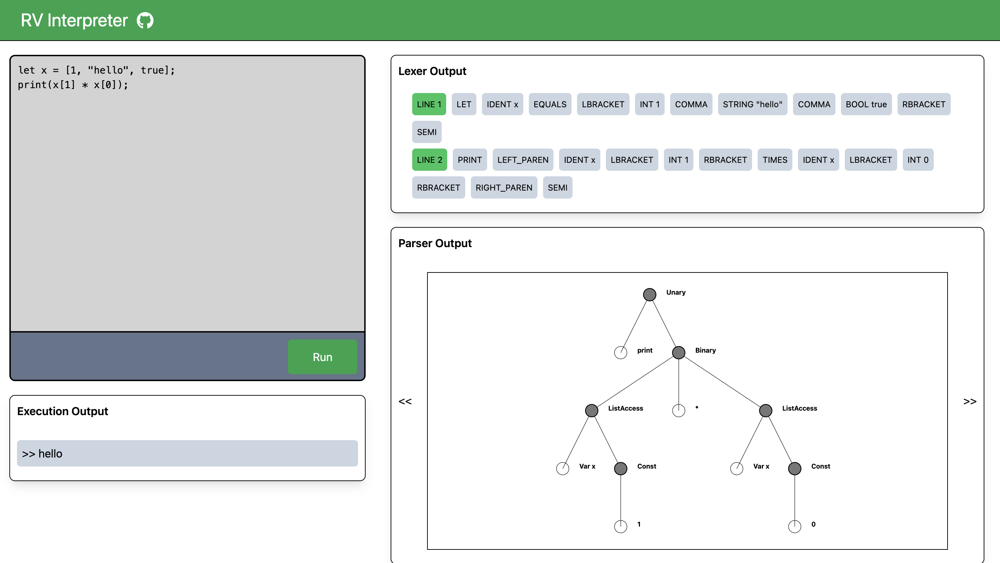

# RV Interpreter Visualizer

This is a [Next.js](https://nextjs.org/) project for visualizing different components (lexer, parser, evaluator) of the [RV interpreter](https://github.com/rohanvan123/rv-interpreter).

<p align="center">
    
</p>

## Live Deployment - [Try it Out!](https://rv-interpreter-frontend.vercel.app/)

This project is currently hosted on **Vercel** and the Flask backend on **Render**. Initial requests may be very slow because it's based on Render's free tier.

## Running Locally

First, run the development server:

```bash
npm run dev
```

Open [http://localhost:3000](http://localhost:3000) with your browser to see the result. Additionally have the flask backend running on [http://localhost:5000](http://localhost:5000)
